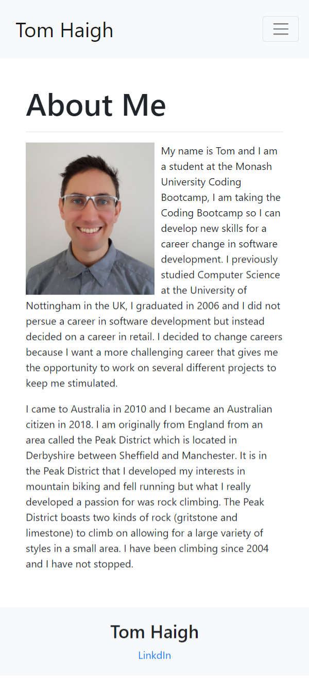
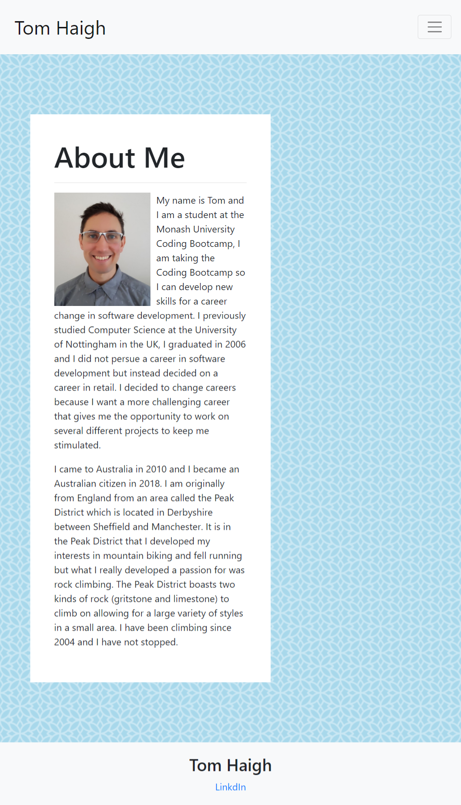
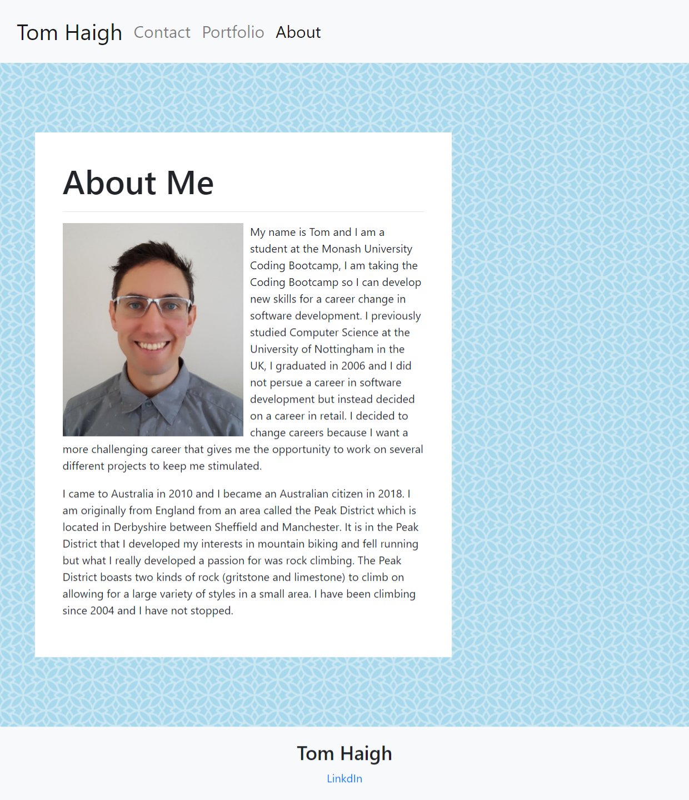

# responsive-portfolio

A responsive portfolio website with an About Me, Portfolio Images and Contact page. The main sections on all the pages will change width according to the viewport.

The Portfolio Images are layed out in a grid using the Bootstrap Layout system. On desktops and larger tablets the portfolio images will be arranged in 2 columns and when the viewport becomes smaller the colums will stack on top of each other.

# Deployed Link

https://conanas.github.io/responsive-portfolio/

# Screenshots

All screenshots can be found here https://github.com/Conanas/responsive-portfolio/tree/master/assets/screenshots

About Me page for mobile devices:

About Me page for tablets:

About Me page for desktops:

